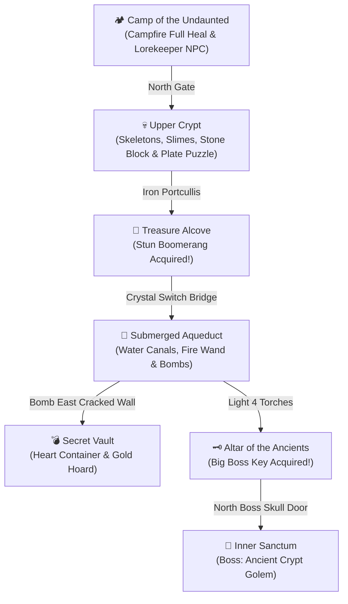

# AETHELGARD: The Sunken Crypt 🗡️🛡️

**A Hardware-Accelerated Top-Down Action RPG & Dungeon Crawler for the Game Boy Advance (ARM7TDMI)**

---

## 1. Overview & Lore

Beneath the ruined citadel of **Aethelgard** lies the **Sunken Crypt** — an ancient subterranean labyrinth of forgotten sarcophagi, submerged aqueducts, and cursed stone sentinels. Guarded by the colossal **Ancient Crypt Golem**, the crypt seals away the sacred **Crown of Aethelgard** and the lost elemental tools of the realm.

As an elite knight explorer of the Citadel Order, you must delve into the darkness, wield your blade, solve mechanical dungeon puzzles, uncover hidden bombable vaults, and vanquish the Ancient Golem in an epic multi-phase boss battle.

---

## 2. Controls & Actions

| Input | Action | In-Game Behavior |
| :--- | :--- | :--- |
| **D-Pad** | 8-Directional Walk | Move through corridors and aim attacks in 4 cardinal facings |
| **A Button** | Sword Slash / Interact | Swings your blade in a 180° arc dealing 2 DMG and knockback; opens chests and speaks with NPCs |
| **B Button** | Use Sub-Weapon | Unleashes the active secondary tool (Boomerang, Bomb, or Fire Wand) |
| **L Shoulder** | Invulnerable Dodge Roll | High-speed forward evasion dash with 18 frames of invulnerability (i-frames) |
| **R / Select** | Quick-Cycle Sub-Weapon | Toggles active sub-weapon in real-time between unlocked tools |
| **Start** | Quest Status & Pause | Opens the parchment inventory showing hearts, gold coins, keys, and relics |

---

## 3. Sub-Weapon Arsenal & Tools

| Sub-Weapon | Icon | Mechanics & Dungeon Applications |
| :--- | :---: | :--- |
| **Stun Boomerang** | 🪃 | Throws a spinning projectile that flies 8 tiles forward before returning to your hand. Stuns monsters for 120 frames and flips distant **Crystal Switches** across chasms. |
| **Remote Bombs** | 💣 | Drops an iron explosive at your feet. Ticks down for 90 frames before detonating in a heavy 6 DMG blast radius that demolishes **Cracked Stone Walls**! |
| **Fire Wand** | 🔥 | Shoots blazing fireballs that ignite cold **Wall Torch Sconces**, solving dungeon light puzzles and igniting foes from range. |

---

## 4. Dungeon Walkthrough & Environment Zones



1. **Camp of the Undaunted (Overworld Entrance)**:
   - Rest beside the campfire to fully restore your hearts.
   - Speak with the Lorekeeper for guidance and tactical secrets.
2. **Upper Crypt (The Hall of Sarcophagi)**:
   - Battle creeping Crypt Slimes and patrolling Skeletal Warriors.
   - Push granite blocks onto the stone pressure plates to open the northern iron portcullis.
   - Open the eastern treasure chest to claim the **Stun Boomerang**.
3. **Submerged Aqueduct**:
   - Cross wooden bridges over deep subterranean waters.
   - Strike the distant violet Crystal Switch with your Boomerang to lower water barriers.
   - Use the **Fire Wand** to ignite the four corner torch braziers.
   - Place a **Remote Bomb** against the cracked stone wall on the east edge to discover the **Secret Vault**!
   - Claim the **Big Boss Key** from the treasure chest to unlock the northern Boss Door.
4. **The Inner Sanctum (Boss: Ancient Crypt Golem)**:
   - **Phase 1 (Stone Aegis)**: Avoid the Golem's rocket fists and ground-pound stalactites using your Dodge Roll (`L`). Damage its fists and stone chassis to expose its core!
   - **Phase 2 (Core Overdrive)**: The Golem's glowing ruby core eye charges a sweeping laser beam! Strike the eye when vulnerable to destroy the golem.
   - **Victory Reward**: Collect the spawned **Heart Container** (+2 Max HP) and purify the crypt!

---

## 5. Technical Specifications & GBA Hardware Features

- **Platform**: Game Boy Advance (ARM7TDMI @ 16.78 MHz)
- **Screen Resolution**: 240 × 160 pixels @ 59.73 Hz (strict hardware VBlank lock)
- **Graphics Pipeline**:
  - **Mode 0 (Text Mode)** with 3 active hardware background layers:
    - **BG0 (Priority 0)**: Non-scrolling HUD (Hearts, Magic Meter, Active Tool, Gold) and dialogue boxes.
    - **BG1 (Priority 1)**: Foreground atmospheric arches and lantern vignette.
    - **BG2 (Priority 2)**: Smooth scrolling $320 \times 240\text{px}$ dungeon room tilemap (`REG_BG2HOFS`/`VOFS`).
  - **Hardware Alpha Blending (`REG_BLDCNT`)**: Real-time atmospheric lantern illumination and dynamic torchlight.
  - **128 Hardware Sprites (OAM)**: Player Knight with 4-directional animations, monsters, boss parts, and VFX.
- **Audio Synthesizer**: Direct GBA PSG sound engine:
  - Channels 1 & 2: Pastoral Camp Theme, Suspenseful Crypt Exploration, and Intense Golem Boss March.
  - Channel 4: White noise swept sword swings, dodge roll whooshes, and heavy bomb detonations.
- **Save Persistence**: Checksum-verified battery SRAM at `0x0E000000` with magic header `"AETH100"`.

---

## 6. How to Build & Play

### Compilation
From the project root:
```bash
make -C dungeon clean && make -C dungeon
```

This compiles `dungeon/dungeon.gba` (256 KB) with complete complement checksum verification (`0xFD`).

### Running in Emulators
```bash
mgba-qt dungeon/dungeon.gba
# or
retroarch -L /path/to/mgba_libretro.so dungeon/dungeon.gba
```
